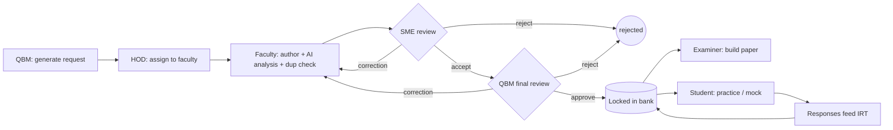

# ItemIQ — Web Application

A production-quality React front-end for **ItemIQ**, the intelligent question-bank
management system built for the **Sindh Institute of Urology and Transplantation
(SIUT)**. It realises the full project specification: the academic hierarchy and
Table of Specification, the five-role authoring-and-review lifecycle, TOS-driven
paper generation, and the three-signal **difficulty intelligence engine**
(faculty + AI + student/IRT).

This is a self-contained, browser-only demonstration — all data is seeded in memory
on load, so every role's workspace shows live numbers immediately. There is no
backend and no real credentials.

---

## Quick start

Requires **Node 18+**.

```bash
cd webapp
npm install
npm run dev        # http://localhost:5173
```

```bash
npm run build      # type-check + production build → dist/
npm run preview    # serve the production build
npm run lint       # oxlint
```

## Signing in

The **Sign in** screen has one-click role logins, or type a seeded email / student
ID with **any password**. Seeded accounts:

| Role | Login |
|------|-------|
| Question Bank Manager | `ashar.minai@siut.edu.pk` |
| Head of Department | `shagufta.yamin@siut.edu.pk` |
| Faculty Member | `bilal.hussain@siut.edu.pk` |
| Subject Matter Expert | `kamran.sheikh@siut.edu.pk` |
| Examiner | `nadia.farooq@siut.edu.pk` |
| Student | `m22-1042` |

Each role lands in its own workspace with a role-specific sidebar.

---

## Tech stack

React 19 · TypeScript · Vite · **Tailwind CSS v4** · **shadcn/ui** (Radix
primitives, owned in `src/components/ui`) · Lucide · React Router v7 · React Hook
Form + Zod · Recharts · Framer Motion · TanStack Table.

---

## What's implemented

- **Academic hierarchy** — Subject → Topic → Subtopic → Description, driving
  classification and the Table of Specification.
- **Question requests** — QBM generates → HOD assigns → faculty authors, with live
  progress tracking per request and per faculty member.
- **Question authoring** — a validated (RHF + Zod) form with a live **AI difficulty
  analysis** (offline heuristic) and live **duplicate detection** (cosine similarity
  against the bank) that flags paraphrased near-duplicates before submission.
- **Two-stage review** — SME review then QBM final review, with **mandatory
  remarks**, accept / correction / reject decisions, a correction loop,
  notifications, and an audit trail. Approved questions lock into the bank.
- **Difficulty engine** — the three-signal weighted formula with **dynamic
  weighting** (`w_student` grows with n toward 0.8), contradiction detection, the
  discrimination quality gate, and Easy/Medium/Hard mapping.
- **Item Response Theory** — an interactive 3-parameter-logistic **Item
  Characteristic Curve**, plus a/b/c interpretation and flags for poor and negative
  discriminators.
- **Practice application (student)** — browse/search/filter the bank, attempt
  questions with immediate feedback, Fisher–Yates **mock exams** (feedback withheld
  to the end), a progress dashboard (streak, per-subject accuracy,
  first-attempt-only accounting) and bookmarks.
- **Paper generation (examiner)** — manual and **automated** modes; automated
  filters the pool per TOS entry, shuffles with **Fisher–Yates**, fills each quota,
  and supports per-slot swapping.
- **Item analytics** — bank-wide difficulty distribution, response volume, and a
  "needs attention" table surfacing flagged items.
- **Notifications** — per-user, with unread badges in the sidebar and topbar.

---

## Sitemap

```
Public
├─ /              Home (marketing)
├─ /features      Feature overview
├─ /about         About ItemIQ
└─ /login         Sign in (role quick-logins)

Authenticated (/app, role-guarded)
├─ Student   /practice · /mock · /progress
├─ Faculty   /faculty · /faculty/new · /faculty/edit/:id
├─ SME       /review
├─ QBM       /manage · /manage/review
├─ HOD       /department
├─ Examiner  /examiner
└─ Shared    /bank · /analytics · /item-analysis · /notifications
```

## Role flows



---

## Project structure

```
src/
├─ components/
│  ├─ ui/          shadcn primitives (button, dialog, select, table, tabs, …)
│  ├─ layout/      AppLayout (sidebar + topbar), PublicLayout, Brand, ThemeToggle
│  ├─ charts/      ICCChart, SignalWeights, OptionDistribution, BarChart (Recharts)
│  └─ common/      PageHeader, Badges, StatTile, EmptyState, QuestionDetailDialog, guards
├─ context/        Auth, DataStore, Theme providers
├─ data/           taxonomy, questionBank, roles, seed (typed)
├─ lib/            engine.ts (difficulty engine), aiAnalysis, similarity, shuffle, format
├─ pages/          public/ + app/{student,faculty,workflow,shared}
├─ types/          domain types derived from the ERD
├─ App.tsx         router with role guards + lazy-loaded app pages
└─ index.css       Tailwind v4 @theme tokens (SIUT red, light + dark)
```

## The difficulty engine

The core math lives in `src/lib/engine.ts`, ported verbatim from the Python
pipeline (`difficulty_tagging.py` / `scoring.py`) so behaviour can't drift:

```
final_score = w_faculty·faculty + w_ai·ai + w_student·student
```

- **Signal mapping** — Easy / Medium / Hard → 0.25 / 0.50 / 0.75.
- **Student signal** — the IRT `b` parameter normalised onto 0–1 (`(b + 3) / 6`).
- **Dynamic weights** — `n = 0` → 50/50 faculty/AI; `0 < n < 100` → student weight
  grows linearly to 0.8; `n ≥ 100` → 10/10/80.
- **Thresholds** — score ≤ 0.40 Easy, ≤ 0.65 Medium, else Hard.
- **Contradiction** — faculty vs AI ≥ 0.5 apart while `n < 50`.
- **Quality gate** — discrimination `a < 0.5` flags a poor discriminator; `a < 0`
  flags a potentially miskeyed item.

## Design system

SIUT crimson (`--brand-500 #c8102e`) is the primary brand colour, applied to app
chrome and the `Hard`/critical semantic only. Charts use a separate validated,
colourblind-safe categorical palette (`--series-1..8`) so data never collides with
brand red. All tokens are defined in `src/index.css` with full **light and dark**
themes (OS default + a toggle in the header/topbar).

## A note on authentication

Authentication is intentionally demo-grade (any password is accepted) because this
is a front-end demonstration with no server. Production would run the same
difficulty engine and IRT mathematics against a real backend with hashed passwords
and signed, expiring tokens.
